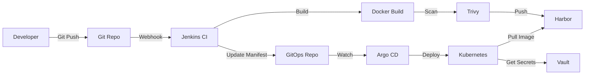

# On-Premise Kubernetes Platform System
## แพลตฟอร์ม Kubernetes แบบ On-Premise

[](https://kubernetes.io/)
[](https://www.jenkins.io/)
[](https://argoproj.github.io/cd/)
[](https://www.vaultproject.io/)

## 📋 Table of Contents / สารบัญ

1. [Overview](#overview--ภาพรวม)
2. [Architecture](#architecture--สถาปัตยกรรม)
3. [Quick Start](#quick-start--เริ่มต้นใช้งาน)
4. [Components](#components--ส่วนประกอบ)
5. [Directory Structure](#directory-structure--โครงสร้างไดเรกทอรี)
6. [Installation Guide](#installation-guide--คู่มือการติดตั้ง)
7. [Security](#security--ความปลอดภัย)
8. [CI/CD Workflow](#cicd-workflow)
9. [Troubleshooting](#troubleshooting--แก้ปัญหา)
10. [Contributing](#contributing--การพัฒนา)

---

## Overview / ภาพรวม

This repository contains infrastructure-as-code (IaC) for deploying a complete **On-Premise Kubernetes Platform** with:

Repository นี้เก็บ infrastructure-as-code (IaC) สำหรับติดตั้งแพลตฟอร์ม Kubernetes แบบ On-Premise ที่มี:

- ✅ **Kubernetes Cluster** - On-premise container orchestration / ระบบจัดการ container แบบ on-premise
- ✅ **Jenkins** - Continuous Integration (CI) / ระบบ CI
- ✅ **Argo CD** - GitOps Continuous Deployment (CD) / ระบบ CD แบบ GitOps
- ✅ **HashiCorp Vault** - Secrets Management / ระบบจัดการ secrets
- ✅ **Harbor** - Container Registry / ระบบเก็บ container images
- ✅ **RBAC & Network Policies** - Zero Trust Security / ความปลอดภัยแบบ Zero Trust
- ✅ **Prometheus & Grafana** - Monitoring & Observability / ระบบ monitoring

---

## Architecture / สถาปัตยกรรม

### 📊 Visual Architecture Diagrams

We provide comprehensive DrawIO diagrams to help you understand the system:

**View all diagrams:** [docs/diagrams/](docs/diagrams/)

| Diagram | Description | Best For |
| ------- | ----------- | -------- |
| [1. Architecture Overview](docs/diagrams/1-architecture-overview.drawio) | Complete platform architecture with all components and layers | Understanding overall system structure |
| [2. Ingress Network Flow](docs/diagrams/2-ingress-network-flow.drawio) | Traffic flow through NGINX Ingress Controller | Setting up Ingress, troubleshooting routing |
| [3. Port-Forward Network Flow](docs/diagrams/3-port-forward-network-flow.drawio) | kubectl port-forward mechanism | Quick local development |
| [4. Deployment Workflow](docs/diagrams/4-deployment-workflow.drawio) | Step-by-step deployment process | First-time deployment, automation |
| [5. Components Relationship](docs/diagrams/5-components-relationship.drawio) | How components interact in CI/CD | Understanding the pipeline |
| [6. Ingress vs Port-Forward](docs/diagrams/6-ingress-vs-portforward-comparison.drawio) | Comparison of access methods | Choosing access method |

**How to view**: Open `.drawio` files at [diagrams.net](https://app.diagrams.net) or use draw.io desktop app.

---

### High-Level Architecture

```
┌─────────────────────────────────────────────────────────────┐
│                         Developers                           │
│                     (Push Code to Git)                       │
└────────────────────┬────────────────────────────────────────┘
                     │
          ┌──────────▼──────────┐
          │   Git Repository    │
          │  (Source of Truth)  │
          └──────────┬──────────┘
                     │
        ┌────────────┴────────────┐
        │                         │
   ┌────▼─────┐            ┌─────▼────┐
   │ Jenkins  │            │ Argo CD  │
   │   (CI)   │            │  (CD)    │
   └────┬─────┘            └─────┬────┘
        │                        │
        │ Build & Push           │ Sync & Deploy
        │                        │
   ┌────▼──────────┐        ┌───▼──────────────┐
   │   Registry    │◄───────┤   Kubernetes     │
   │   (Harbor)    │ Pull   │     Cluster      │
   └───────────────┘        └────────┬─────────┘
                                     │
                       ┌─────────────┴─────────────┐
                       │                           │
                  ┌────▼────┐              ┌───────▼───────┐
                  │  Vault  │              │   Workloads   │
                  │(Secrets)│◄─────────────┤  (Dev/SIT/    │
                  └─────────┘  Inject      │   UAT/Prod)   │
                                           └───────────────┘
```

### Component Interaction



---

## Quick Start / เริ่มต้นใช้งาน

### Prerequisites / ความต้องการเบื้องต้น

- Kubernetes cluster (v1.24+) / Kubernetes cluster เวอร์ชั่น 1.24 ขึ้นไป
- kubectl configured / ตั้งค่า kubectl แล้ว
- Helm 3 installed / ติดตั้ง Helm 3 แล้ว
- Minimum 3 nodes (1 master + 2 workers) / อย่างน้อย 3 nodes
- Storage class configured / มี storage class

### Fast Deploy (All Components)

```bash
# Clone repository
git clone <your-repo-url>
cd k8s

# Deploy all components
./scripts/deploy-all.sh

# Or deploy step by step
./scripts/01-deploy-namespaces.sh
./scripts/02-deploy-security.sh
./scripts/03-deploy-core-components.sh
./scripts/04-deploy-monitoring.sh
```

### Access Services

```bash
# Get all services
kubectl get svc -A

# Port forward Jenkins
kubectl port-forward -n jenkins svc/jenkins 8080:8080

# Port forward Argo CD
kubectl port-forward -n argocd svc/argocd-server 8080:443

# Port forward Vault
kubectl port-forward -n vault svc/vault 8200:8200
```

---

## Components / ส่วนประกอบ

### 1. **Namespaces & Resource Quotas** / Namespaces และ Resource Quotas
- Isolated environments for dev, sit, uat, prod
- Resource limits per namespace
- **Location:** `environments/*/namespace.yaml`

### 2. **RBAC (Role-Based Access Control)** / การควบคุมสิทธิ์
- ClusterAdmin - Platform team
- NamespaceAdmin - Tech leads
- Developer - Limited access
- **Location:** `security/rbac/`

### 3. **Network Policies** / Network Policies
- Zero Trust network architecture
- Default deny all traffic
- Allow-list specific connections
- **Location:** `security/network-policies/`

### 4. **Jenkins (CI)** / Jenkins สำหรับ CI
- Kubernetes-native dynamic agents
- Pipeline as Code
- Integration with Vault & SonarQube
- **Location:** `core-components/jenkins/`

### 5. **Argo CD (CD)** / Argo CD สำหรับ CD
- GitOps continuous deployment
- Auto-sync for dev/sit
- Manual approval for uat/prod
- **Location:** `core-components/argocd/`

### 6. **HashiCorp Vault** / Vault สำหรับ Secrets
- Centralized secrets management
- Kubernetes auth integration
- Automatic secret injection
- **Location:** `core-components/vault/`

### 7. **Harbor (Container Registry)** / Harbor สำหรับเก็บ Container Images
- Private container registry
- Vulnerability scanning
- Image signing
- **Location:** `core-components/harbor/`

### 8. **Prometheus & Grafana** / Monitoring
- Metrics collection
- Dashboards
- Alerting
- **Location:** `observability/`

---

## Directory Structure / โครงสร้างไดเรกทอรี

```
k8s/
├── README.md                           # This file / ไฟล์นี้
├── docs/                               # Documentation / เอกสาร
│   ├── diagrams/                       # Architecture diagrams (DrawIO)
│   ├── prd_on_premise_kubernetes_platform_system.md
│   ├── system_architecture_design.md
│   ├── local-development-guide.md      # Local dev guide
│   ├── ingress-setup-guide.md          # Ingress setup
│   ├── quick-command-reference.md      # Quick commands
│   ├── manual-installation-steps.md    # Manual installation
│   └── implementation_tasks.md         # Task checklist / รายการงาน
│
├── infrastructure/                     # Infrastructure configs / การตั้งค่าโครงสร้างพื้นฐาน
│   ├── cluster/                        # Cluster setup
│   ├── storage/                        # Storage configs
│   └── load-balancer/                  # Load balancer configs
│
├── environments/                       # Environment configs / การตั้งค่า environment
│   ├── dev/                           # Development
│   ├── sit/                           # System Integration Test
│   ├── uat/                           # User Acceptance Test
│   └── prod/                          # Production
│
├── core-components/                    # Core platform components / ส่วนประกอบหลัก
│   ├── jenkins/                       # Jenkins CI
│   ├── argocd/                        # Argo CD
│   ├── vault/                         # HashiCorp Vault
│   ├── harbor/                        # Container Registry
│   └── ingress-nginx/                 # Ingress Controller
│
├── security/                          # Security configs / การตั้งค่าความปลอดภัย
│   ├── rbac/                          # Role-Based Access Control
│   ├── network-policies/              # Network Policies
│   └── vault-policies/                # Vault Policies
│
├── ci-cd/                             # CI/CD configs / การตั้งค่า CI/CD
│   ├── jenkins-pipelines/             # Jenkins pipeline templates
│   └── argocd-apps/                   # Argo CD application definitions
│
├── observability/                     # Monitoring & Logging / การ monitor และ log
│   ├── prometheus/                    # Prometheus configs
│   ├── grafana/                       # Grafana dashboards
│   └── loki/                          # Loki logging
│
└── scripts/                           # Deployment scripts / สคริปต์สำหรับติดตั้ง
    ├── deploy-all.sh                  # Deploy everything
    ├── 01-deploy-namespaces.sh
    ├── 02-deploy-security.sh
    ├── 03-deploy-core-components.sh
    └── 04-deploy-monitoring.sh
```

---

## Installation Guide / คู่มือการติดตั้ง

### Phase 1: Infrastructure & Namespaces

```bash
# Create namespaces with resource quotas
kubectl apply -f environments/dev/namespace.yaml
kubectl apply -f environments/sit/namespace.yaml
kubectl apply -f environments/uat/namespace.yaml
kubectl apply -f environments/prod/namespace.yaml

# Verify
kubectl get namespaces
kubectl get resourcequota -A
```

### Phase 2: Security (RBAC & Network Policies)

```bash
# Apply RBAC
kubectl apply -f security/rbac/

# Apply Network Policies
kubectl apply -f security/network-policies/

# Verify
kubectl get rolebindings -A
kubectl get networkpolicies -A
```

### Phase 3: Core Components

#### Install Jenkins
```bash
cd core-components/jenkins
helm repo add jenkins https://charts.jenkins.io
helm install jenkins jenkins/jenkins -f values.yaml -n jenkins --create-namespace
```

#### Install Argo CD
```bash
cd core-components/argocd
helm repo add argo https://argoproj.github.io/argo-helm
helm install argocd argo/argo-cd -f values.yaml -n argocd --create-namespace
```

#### Install Vault
```bash
cd core-components/vault
helm repo add hashicorp https://helm.releases.hashicorp.com
helm install vault hashicorp/vault -f values.yaml -n vault --create-namespace

# Initialize and configure
chmod +x init-unseal.sh configure-vault.sh
./init-unseal.sh
./configure-vault.sh
```

See detailed instructions in each component's README:
- [Jenkins README](core-components/jenkins/README.md)
- [Argo CD README](core-components/argocd/README.md)
- [Vault README](core-components/vault/README.md)

### Phase 4: Monitoring

```bash
# Install Prometheus & Grafana
cd observability/prometheus
kubectl apply -f prometheus-stack.yaml
```

---

## Security / ความปลอดภัย

### Zero Trust Principles / หลักการ Zero Trust

1. **Default Deny** - All traffic blocked by default / บล็อก traffic ทั้งหมดโดย default
2. **Explicit Allow** - Only allowed traffic permitted / อนุญาตเฉพาะที่กำหนดไว้
3. **Least Privilege** - Minimum required permissions / สิทธิ์น้อยที่สุด
4. **Audit Everything** - All actions logged / บันทึกทุก action

### Security Checklist / รายการตรวจสอบความปลอดภัย

- [ ] RBAC configured and tested / ตั้งค่า RBAC แล้ว
- [ ] Network Policies applied / ใส่ Network Policy แล้ว
- [ ] Secrets stored in Vault / เก็บ secret ใน Vault
- [ ] TLS enabled for all services / เปิด TLS ทุก service
- [ ] Image scanning enabled / เปิด image scanning
- [ ] Audit logging enabled / เปิด audit logging
- [ ] Default ServiceAccount auto-mount disabled / ปิด auto-mount token
- [ ] Pod Security Standards enforced / บังคับ Pod Security Standards

---

## CI/CD Workflow

### Development Flow / ขั้นตอนการพัฒนา

```
1. Developer pushes code to Git
   นักพัฒนา push code เข้า Git
   ↓
2. Jenkins webhook triggered
   Jenkins ถูก trigger
   ↓
3. Jenkins runs pipeline:
   Jenkins รัน pipeline:
   - Checkout code
   - Run tests
   - Build Docker image
   - Scan with Trivy
   - Push to Harbor
   - Update GitOps repo
   ↓
4. Argo CD detects change
   Argo CD ตรวจพบการเปลี่ยนแปลง
   ↓
5. Argo CD syncs to cluster
   Argo CD sync ไปยัง cluster
   - Dev: Auto-sync
   - SIT: Auto-sync
   - UAT: Manual approval
   - Prod: Manual approval
   ↓
6. Application deployed
   แอพพลิเคชั่นถูก deploy
```

### Example Jenkins Pipeline

See: `ci-cd/jenkins-pipelines/Jenkinsfile.example`

### Example Argo CD Application

See: `ci-cd/argocd-apps/application-example.yaml`

---

## Troubleshooting / แก้ปัญหา

### Common Issues / ปัญหาที่พบบ่อย

#### 1. Pods can't pull images
```bash
# Check image pull secrets
kubectl get secret -n <namespace>

# Check Harbor is accessible
kubectl run test --image=busybox -it --rm -- wget -O- http://harbor.harbor.svc.cluster.local
```

#### 2. Pods can't access other services
```bash
# Check Network Policies
kubectl get networkpolicy -n <namespace>

# Test connectivity
kubectl run test -n <namespace> --image=busybox -it --rm -- wget -O- http://service:port
```

#### 3. Secrets not injected from Vault
```bash
# Check Vault is unsealed
kubectl exec -n vault vault-0 -- vault status

# Check pod annotations
kubectl describe pod -n <namespace> <pod-name>

# Check Vault logs
kubectl logs -n vault -l app.kubernetes.io/name=vault-agent-injector
```

#### 4. Jenkins can't spawn agents
```bash
# Check RBAC
kubectl get rolebinding -n jenkins

# Check service account
kubectl get sa jenkins -n jenkins

# Check Jenkins logs
kubectl logs -n jenkins -l app.kubernetes.io/component=jenkins-controller
```

### Getting Help / ขอความช่วยเหลือ

1. Check component-specific README files
2. Review logs: `kubectl logs -n <namespace> <pod-name>`
3. Check events: `kubectl get events -n <namespace> --sort-by='.lastTimestamp'`
4. Check resource status: `kubectl describe <resource> -n <namespace>`

---

## Monitoring / การ Monitor

### Dashboards

- **Grafana**: `http://grafana.company.local`
- **Prometheus**: `http://prometheus.company.local`
- **Argo CD**: `https://argocd.company.local`
- **Jenkins**: `http://jenkins.company.local`
- **Vault UI**: `https://vault.company.local`

### Key Metrics / ตัวชี้วัดสำคัญ

- Deployment frequency / ความถี่ในการ deploy
- Lead time for changes / เวลาที่ใช้ในการเปลี่ยนแปลง
- Mean time to recovery (MTTR) / เวลาเฉลี่ยในการแก้ไข
- Change failure rate / อัตราความล้มเหลว

---

## Contributing / การพัฒนา

### Development Workflow

1. Create feature branch
2. Make changes
3. Test in dev environment
4. Create pull request
5. Review and approve
6. Merge to main
7. Deploy to environments

### Coding Standards

- Use YAML for Kubernetes manifests
- Follow naming conventions
- Document all configurations
- Test before committing

---

## References / อ้างอิง

### Documentation / เอกสาร

- **Architecture Diagrams** - [View all diagrams](docs/diagrams/)
- **Local Development** - [Local Development Guide](docs/local-development-guide.md)
- **Ingress Setup** - [Ingress Setup Guide](docs/ingress-setup-guide.md)
- **Quick Commands** - [Quick Command Reference](docs/quick-command-reference.md)
- **Manual Installation** - [Manual Installation Steps](docs/manual-installation-steps.md)
- **PRD** - [Product Requirements Document](docs/prd_on_premise_kubernetes_platform_system.md)
- **SAD** - [System Architecture Design](docs/system_architecture_design.md)
- **Tasks** - [Implementation Tasks](docs/implementation_tasks.md)

### External Resources
- [Kubernetes Documentation](https://kubernetes.io/docs/)
- [Jenkins Documentation](https://www.jenkins.io/doc/)
- [Argo CD Documentation](https://argo-cd.readthedocs.io/)
- [Vault Documentation](https://www.vaultproject.io/docs)
- [GitOps Principles](https://opengitops.dev/)

---

## License / ใบอนุญาต

This project is licensed under the MIT License.

---

## Support / การสนับสนุน

For issues and questions / สำหรับปัญหาและคำถาม:
- Create an issue in this repository
- Contact the platform team
- Email: platform-team@company.local

---

**Built with ❤️ by Platform Engineering Team**

**สร้างด้วย ❤️ โดยทีม Platform Engineering**
