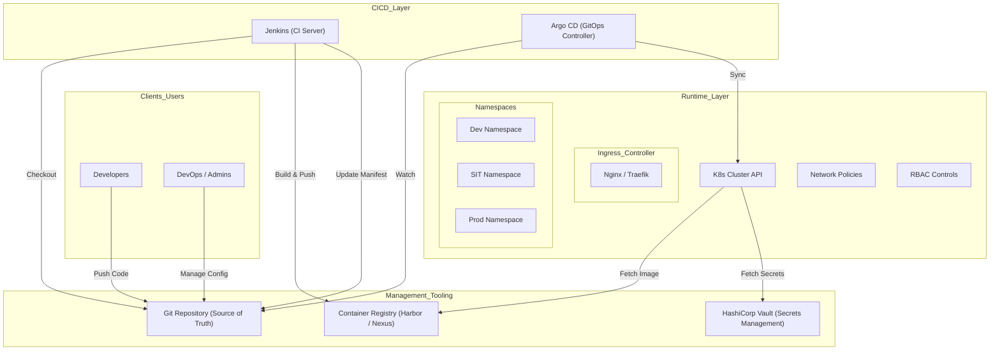
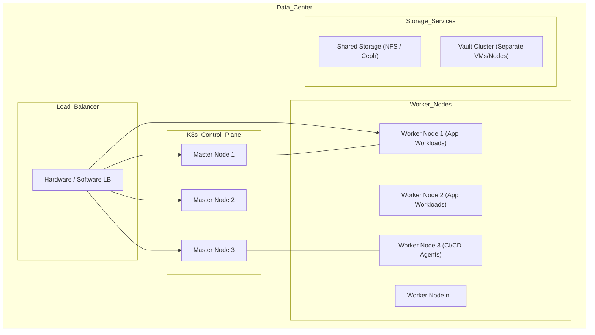
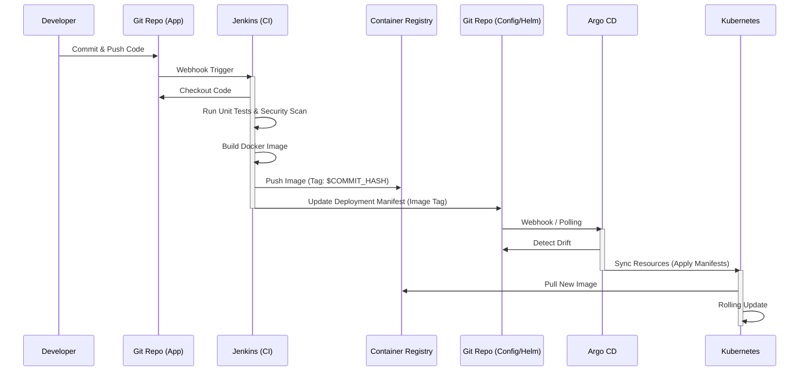

# System Architecture Design (SAD)

## On-Premise Kubernetes Platform System

| Document Version | 1.0.4 |
| :--- | :--- |
| **Status** | Draft |
| **Last Updated** | 2025-12-26 |
| **Author** | System Architect |

---

## Table of Contents

1. [Introduction](#1-introduction)
2. [System Architecture](#2-system-architecture)
    - [2.1 Logical Architecture](#21-logical-architecture)
    - [2.2 Physical Architecture](#22-physical-architecture)
3. [CI/CD Pipeline Design](#3-cicd-pipeline-design)
    - [3.1 CI/CD Workflow](#31-cicd-workflow)
    - [3.2 Component Details](#32-component-details)
4. [Security Design](#4-security-design)
    - [4.1 Secrets Management (Vault)](#41-secrets-management-vault)
    - [4.2 RBAC & Access Control](#42-rbac--access-control)
    - [4.3 Zero Trust Strategy](#43-zero-trust-strategy)
5. [Non-Functional Requirements](#5-non-functional-requirements)

---

## 1. Introduction

### 1.1 Purpose

This System Architecture Design (SAD) document details the technical implementation of the On-Premise Kubernetes Platform. It translates the business requirements from the PRD into technical specifications, focusing on a secure, scalable, and GitOps-driven delivery model independent of public cloud services.

### 1.2 Scope

- **Infrastructure**: On-Premise Kubernetes Cluster (Control Plane & Worker Nodes).
- **CI/CD**: Jenkins for Continuous Integration and Argo CD for Continuous Deployment.
- **Security**: HashiCorp Vault for secrets management, RBAC for access control, and Network Policies for isolation.
- **Operations**: Logging, Monitoring, and alerting strategies (to be implemented via standard observability stacks).

---

## 2. System Architecture

### 2.1 Logical Architecture

The logical architecture separates concerns into Management, CI/CD, and Runtime layers.



### 2.2 Physical Architecture

The physical architecture highlights the distribution of components across hardware/virtual nodes to ensure High Availability (HA).



**Key Considerations:**

- **Control Plane**: 3 nodes for etcd quorum and API availability.
- **Worker Nodes**: Separated operational workloads (CI/CD agents) from functional application workloads if resource contention is high, otherwise managed via ResourceQuotas.
- **Storage**: Persistent Volumes (PVs) backed by enterprise storage (NFS/Ceph/StorageClass).

---

## 3. CI/CD Pipeline Design

### 3.1 CI/CD Workflow

The flow implements a strict **GitOps** model.

**Flow Diagram: Jenkins → Argo CD → K8S**



### 3.2 Component Details

#### Continuous Integration (Jenkins)

* **Trigger**: Webhook from Source Code Management (SCM).
- **Stages**:
    1. **Checkout**: Pull source code.
    2. **Test**: Run unit tests, integration tests, and static code analysis (SonarQube).
    3. **Build**: Create Docker container image.
    4. **Scan**: Vulnerability scanning (e.g., Trivy) on the image.
    5. **Push**: Upload image to local Registry.
    6. **Update Manifest**: Automated commit to the *k8s-manifest* repository updating the image tag.

#### Continuous Deployment (Argo CD)

* **Sync Policy**: Automated for Dev/SIT; Manual Approval for UAT/Prod.
- **Pruning**: Enabled (removes resources no longer in Git).
- **Self-Heal**: Enabled (resets manual changes made directly to the cluster).
- **Health Checks**: Custom health checks for services to ensure deployment success before marking as "Healthy".

---

## 4. Security Design

### 4.1 Secrets Management (Vault)

**Vault Integration Strategy**: Use the **Vault Kubernetes Auth Method**. Applications will not store secrets in environment variables or Git. Instead, they will be injected at runtime.

**Vault Policy Structure (HCL)**:

```hcl
# Policy for 'finance-service' in 'dev' environment
path "secret/data/dev/finance-service/*" {
  capabilities = ["read"]
}

# Policy for Jenkins (to read/write specific secrets if needed)
path "secret/data/ci/*" {
  capabilities = ["create", "read", "update"]
}
```

**Injection Mechanism**:

- Uses **Vault Agent Injector** (Sidecar pattern).
- Pod annotations trigger the injection of secrets into `/vault/secrets/config`.

### 4.2 RBAC & Access Control

**Kubernetes RBAC**:

- **ClusterAdmin**: Platform Team only.
- **NamespaceAdmin**: Tech Leads (scoped to their specific project namespace).
- **Developer**: Read-only access to their namespace; `port-forward` and `exec` permissions granted only if necessary and audited.
- **ServiceAccounts**: Minimal privileges; no automounting of API tokens unless required.

**Argo CD RBAC**:

- **Admins**: Full access to manage Applications and Clusters.
- **Developers**: `get`, `sync` permissions for applications belonging to their specific project. Cannot modify Cluster config.

### 4.3 Zero Trust Strategy

1. **Identity-Based Logic**:
    - Every workload must have a verified identity (ServiceAccount).
    - Mutual TLS (mTLS) enforced between services (via Service Mesh if implemented in Future Phase, or Ingress TLS termination).
2. **Network Policies**:
    - **Default Deny**: All ingress/egress traffic is blocked by default in every namespace.
    - **Allow-List**: Only explicitly allowed traffic (e.g., Frontend -> Backend:8080) is permitted.

**Example NetworkPolicy**:

```yaml
apiVersion: networking.k8s.io/v1
kind: NetworkPolicy
metadata:
  name: default-deny-all
  namespace: finance
spec:
  podSelector: {}
  policyTypes:
  - Ingress
  - Egress
```

---

## 5. Non-Functional Requirements

### 5.1 Reliability & Availability

- **Cluster**: Multi-master control plane.
- **Application**: Minimum `replicas: 2` with `PodAntiAffinity` to spread pods across physical nodes.
- **Storage**: Distributed storage with replication factor >= 3.

### 5.2 Observability

- **Logs**: Centralized aggregation (Elasticsearch/Loki).
- **Metrics**: Prometheus scraping with Grafana dashboards.
- **Audit**: Kubernetes Audit Logs enabled and forwarded to a secure, tamper-proof bucket/storage.

### 5.3 Compliance

- All images must pass vulnerability scanning before deployment.
- Deployment history is immutable (Git Commit History).
- No direct shell access to production containers without "Break Glass" procedure and auditing.
